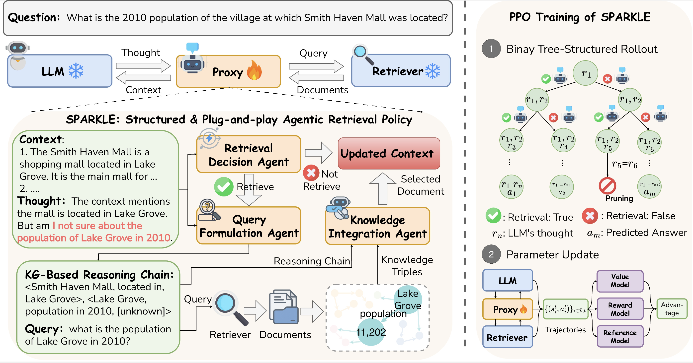

<h1 align="center">
    SPARKLE: A Structured and Plug-and-play Agentic Retrieval Policy for Adaptive RAG Models
</h1>

This repository contains the implementation of SPARKLE framework, which introduces a lightweight proxy model to guide adaptive retrieval and knowledge integration in RAG models.

Details about SPARKLE can be found in our paper. 

## Introduction 
Adaptive retrieval-augmented generation (RAG) models offer an effective approach for integrating external knowledge. However, existing methods either rely on frozen large language models (LLMs) without explicit supervision or require costly LLM finetuning. Therefore, we propose SPARKLE, a structured and plug-and-play agentic retrieval policy where an additional proxy model is introduced to control the retrieval process. The proxy model leverages knowledge graph-based reasoning to make retrieval decisions in a structured manner, while operating independently of the retriever and the LLM. This plug-and-play design allows SPARKLE to generalise across different retrievers and LLMs. SPARKLE is optimised via reinforcement learning (RL), treating the retriever and the LLM as part of the environment. To enable more effective exploration during RL training, we further introduce a binary tree-structured rollout strategy. Experiments on three in-domain and four out-of-domain QA benchmarks show that SPARKLE outperforms state-of-the-art adaptive RAG baselines, achieving average improvements of 9.17% and 2.85%, respectively.

<figure style="text-align: center;">
  
  <figcaption>(left) Overview of SPARKLE. At each reasoning step, the Retrieval Decision Agent determines whether retrieval is needed. If so, the Query Formulation Agent and the Knowledge Integration Agent are invoked to generate a search query and incorporate relevant information into the context, respectively. (right) PPO training of SPARKLE, which employs a binary tree-structured rollout to explore multiple reasoning paths during reinforcement learning.</figcaption>
</figure>

## Contents
- [Environment Setup](#setup)
- [Resources](#resources)
- [Training](#training)
- [Evaluation](#evaluation)

## Environment Setup
Our code is built on PyTorch and Transformers, you can setup environment using the following commands: 
```
conda create -n sparkle python=3.10
conda activate sparkle
pip install -r requirements.txt 
```

## Resources
The datasets, corpus index and prebuilt KG corpus can be downloaded from [here](https://osf.io/u6xa7/files/osfstorage), where we provide resources for the 2WikiMultiHopQA dataset as an example.

## Training
The training of SPARKLE relies on the [OpenRLHF](https://github.com/OpenRLHF/OpenRLHF) repo. Run the following script to run SFT and PPO training of SPARKLE:
```
bash training_script.sh
```

## Evaluation
Run the following script to run inference:
```
bash inference_script.sh
```
