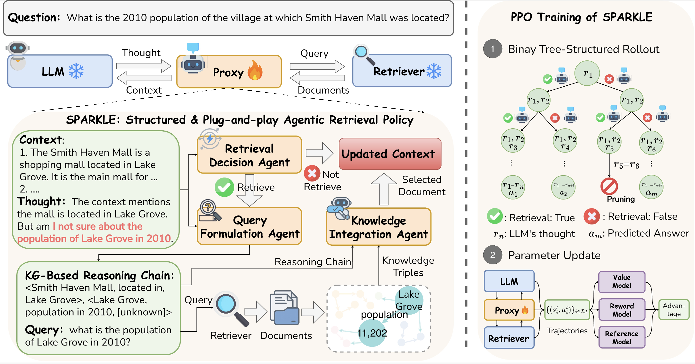

<h1 align="center">
    SPARKLE: A Structured and Plug-and-play Agentic Retrieval Policy for Adaptive RAG Models
</h1>

This repository contains the implementation of SPARKLE framework, which introduces a lightweight proxy model to guide adaptive retrieval and knowledge integration in RAG models.

Details about SPARKLE can be found in our paper. 

## Introduction 
Adaptive retrieval-augmented generation (RAG) models offer an effective approach for integrating external knowledge. However, existing methods either rely on frozen large language models (LLMs) without explicit supervision or require costly LLM finetuning. Therefore, we propose SPARKLE, a structured and plug-and-play agentic retrieval policy where an additional proxy model is introduced to control the retrieval process. The proxy model leverages knowledge graph-based reasoning to make retrieval decisions in a structured manner, while operating independently of the retriever and the LLM. This plug-and-play design allows SPARKLE to generalise across different retrievers and LLMs. SPARKLE is optimised via reinforcement learning (RL), treating the retriever and the LLM as part of the environment. To enable more effective exploration during RL training, we further introduce a binary tree-structured rollout strategy. Experiments on three in-domain and four out-of-domain QA benchmarks show that SPARKLE outperforms state-of-the-art adaptive RAG baselines, achieving average improvements of 9.17% and 2.85%, respectively.

<figure style="text-align: center;">
  
  <figcaption>(left) Overview of SPARKLE. At each reasoning step, the Retrieval Decision Agent determines whether retrieval is needed. If so, the Query Formulation Agent and the Knowledge Integration Agent are invoked to generate a search query and incorporate relevant information into the context, respectively. (right) PPO training of SPARKLE, which employs a binary tree-structured rollout to explore multiple reasoning paths during reinforcement learning.</figcaption>
</figure>

## Contents
- [Environment Setup](#setup)
- [Resources](#resources)
- [Training](#training)
- [Evaluation](#evaluation)

## Environment Setup
Our code is built on PyTorch and Transformers, you can setup environment using the following commands: 
```
conda create -n sparkle python=3.10
conda activate sparkle
pip install -r requirements.txt 
```

## Resources
The datasets, corpus index and prebuilt KG corpus can be downloaded from [here](https://osf.io/u6xa7/files/osfstorage), where we provide resources for the 2WikiMultiHopQA dataset as an example.

## Training
The training of SPARKLE relies on the [OpenRLHF](https://github.com/OpenRLHF/OpenRLHF) repo. Run the following script to run SFT and PPO training of SPARKLE:
```
bash training_script.sh
```

## Evaluation
Run the following script to run inference:
```
bash inference_script.sh
```

## Failure Cases Analysis 

### Case 1: 

**Question**: Who is the mother of the composer of film 404 (Film)?

**Gold Answer**: Ratna Pathak

**LLM Output**: 
```
<think> The question asks about the mother of the composer of the film "404". I need to first identify the composer of "404".</think>
<think> The context for "404 (film)" mentions Prawaal Raman as the writer and director, but does not mention a composer. I need to look for information about the composer elsewhere.</think>
<think> There is no direct information about the composer of "404" in the provided context. I should check if any composer is mentioned in relation to "404" in the other texts.</think>
<think> The text for "Pilgrimage (2001 film)" mentions John Tavener as the composer of the score for that film, but "404" is not mentioned in this context.</think>
<think> The text for "Reinhold Heil" mentions him as a composer, but he is not associated with "404" in the given context.</think>
<think> The text for "James S. Levine" mentions him as a composer, but he is not associated with "404" in the given context either.</think>
<think> Since there is no direct information about the composer of "404" in the provided texts, and the question asks about the mother of the composer, I cannot determine this information from the given context.</think>
<answer> Unknown </answer>
```

Fail to retrieve relevant context. 

### Case 2: 
**Question**: Which country the composer of film Sergeant Hassan is from?

**Gold Answer**: Malaysia

**LLM Output**: 
```
<think> The question ask about the composer of the film "Sergeant Hassan". I need to find information linking the film to a composer and their nationality. </think>
<think> The context mentions "Sarjan Hassan or Sergeant Hassan is one of the film starring P. Ramlee". This indicates the film is related to P. Ramlee, but no composer is mentioned. </think>
<think> The context does not provide direct information about the composer of "Sergeant Hassan". I need to consider if any other composer mentioned in the context could be related to this film. </think>
<think> The context mentions Sajjad Hussain as an Indian film score composer. However, there is no direct link to "Sergeant Hassan" in the provided information. </think>
<think> Since there is no direct information about the composer of "Sergeant Hassan", and no clear link to any composer from the given context, I cannot determine the nationality of the composer based on the provided information. </think>
<answer> Unknown </answer>
```

Fail to retrieve relevant context. 

### Case 3: 
**Question**: Which film has the director died later, Morecambe Church Lads' Brigade At Drill or Anne Against The World?

**Gold Answer**: Anne Against The World

**LLM Output**: 
```
<think> I need to find the directors of both films and check their lifespans to determine which one died later. </think>
<think> For Morecambe Church Lads' Brigade at Drill, the directors are James Kenyon and Sagar Mitchell. I need to find their lifespan information. </think>
<think> For Anne Against the World, the director is Duke Worne. I need to find his lifespan information. </think>
<think> I will now look up the lifespan of James Kenyon and Sagar Mitchell. </think>
<think> James Kenyon died on 6 February 1925. </think>
<think> Sagar Mitchell died on 2 October 1952. </think>
<think> Now I will look up the lifespan of Duke Worne. </think>
<think> Duke Worne died on 13 October 1933. </think>
<think> Comparing the death dates, Sagar Mitchell died later than Duke Worne. </think>
<answer> Morecambe Church Lads' Brigade At Drill </answer>
```

The film Morecambe Church Lads' Brigade At Drill has two directors: James Kenyon and Sagar Mitchell. While the death dates of these two directors are correct, the LLM implicitly assumes that when a film has multiple directors, it is acceptable to select the one who died latest and use that date for comparison. This assumption is not stated in the question and introduces ambiguity into the reasoning process.

The question asks: “Which film has the director died later?” However, it does not clarify how to handle films with multiple directors. In the case of Morecambe Church Lads' Brigade At Drill, there are two directors with different death dates (1925 and 1952). The LLM chooses Sagar Mitchell (d. 1952) as the comparison point against Duke Worne (d. 1933), effectively redefining the question as: “Which film has at least one director who died later?” This reinterpretation is unstated and may not align with the intended comparison.

Because the comparison rule is not explicitly defined, the reasoning becomes structurally unstable. A different but equally plausible interpretation—such as comparing the first-listed director, or requiring a single-director film for clean comparison—could yield a different analytical path. Therefore, although the factual death dates are correct, the answer relies on an unarticulated assumption, making the reasoning process vague and potentially unreliable rather than definitively correct.

### Case 4: 
**Question**: What is the place of birth of the director of film Huey Long (Film)?

**Gold Answer**: Brooklyn

**LLM Output**: 
```
<think> The question asks for the place of birth of the director of the film "Huey Long (film)". I need to first find out the director of the film.</think>
<think> The context provides information about the film "Huey Long (film)" and its director, Ken Burns. </think>
<think> I need to find Ken Burns' place of birth from the given information. </think>
<think> The context about Ken Burns states he was born in 1953 but does not specify his place of birth. </think>
<think> However, the question specifically asks for the director of "Huey Long (film)", which is Ken Burns, and the context does not provide his place of birth. </think>
<think> Since the place of birth is not provided in the given information, I cannot determine it from the context. </think>
<answer> Unknown </answer>
```

Fail to retrieve relevant context. 

### Case 5: 
**Question**: Which film whose director is younger, Swaroopam or Swedenhielms?

**Gold Answer**: Swaroopam

**LLM Output**: 
```
<think> I need to compare the release years of the films directed by the potential directors to determine who is younger. First, I'll find the director of Swaroopam. </think>
<think> Swaroopam is a 1992 Malayalam film. The director is K. R. Mohanan. </think>
<think> Now, I need to find the director of Swedenhielms. </think>
<think> Swedenhielms is a 1935 Swedish comedy-drama film. The director is Gustaf Molander. </think>
<think> I now have the release years of both films. I need to find out who Gustaf Molander and K. R. Mohanan are, to determine their ages at the time of directing these films. </think>
<think> From the provided information, Gustaf Molander lived from 1888 to 1973. </think>
<think> K. R. Mohanan is not explicitly mentioned to have a birth year, but the film Swaroopam was made in 1992. </think>
<think> To determine who is younger, I need to calculate their ages at the time of directing their respective films. </think>
<think> Gustaf Molander directed Swedenhielms in 1935, so he was 47 years old. </think>
<think> K. R. Mohanan directed Swaroopam in 1992, so he was 74 years old. </think>
<think> Since Gustaf Molander was younger at the time of directing Swedenhielms, the film directed by the younger director is Swedenhielms. </think>
<answer> Swedenhielms </answer>
```
The LLM makes a reasoning error by comparing the directors’ ages at the time of directing the films, rather than comparing the directors’ actual ages (birth years) to determine who is younger as a person.

### Case 6: 

**Question**: Where was the father of Edward The Exile born?

**Gold Answer**: Wessex

**LLM Output**:
```
<think> The question asks for the birthplace of the father of Edward The Exile. I need to find out who is the father of Eward The Exile. </think>
<think> The text mentions that Edward the Exile's father was King Edmund Ironside. I need to find information about King Edmund Ironside's background. </think>
<think> The text about Edmund Ironside provides details about his parentage and early life, but it does not directly state where he was born. However, it mentions that he was the son of King Æthelred the Unready and his first wife, Ælfgifu of York. This suggests that Edmund Ironside was likely born in England, as he was the son of the king. </think>
<think> Since the text does not explicitly state the birthplace of King Edmund Ironside, and given the context that he was the son of the king, it is reasonable to infer that he was born in England. </think>
<answer> England </answer>
```
The LLM answers incorrectly because it makes a broad inference (“England”) instead of identifying the specific historical kingdom (Wessex) where Edmund Ironside was born, failing to provide the precise birthplace required by the question.

### Case 7: 
**Question**: Where was the place of death of Beata Łaska Z Kościeleckich's father?

**Gold Answer**: Kraków

**LLM Output**: 
```
<think> The question asks for the place of death of Beata Łaska z Kościeleckich's father. I need to find this information. </think>
<think> The context about Beata Łaska z Kościeleckich mentions her parents but does not provide information about their places of death. I need to look for information about her father, Andrzej Kościelecki. </think>
<think> The text about Andrzej Kościelecki provides extensive details about his life and positions but does not explicitly state where he died. I need to check if there is any indirect information that might help determine his place of death. </think>
<think> Since the provided texts do not contain the specific information about Andrzej Kościelecki's place of death, and there is no other context that could provide this information, I cannot determine the place of death from the given information. </think>
<answer> Unknown </answer>
```
Fail to retrieve relevant context. 

### Case 8: 

**Question**: What is the place of birth of the director of film Undiscovered?

**Gold Answer**: Irish

**LLM Output**: 
```
<think> The question asks for the place of birth of the director of the film "Undiscovered". I need to identify the director first from the given context.</think>
<think> The context states that "Undiscovered" is a 2005 film directed by Meiert Avis.</think>
<think> Now, I need to find the place of birth of Meiert Avis.</think>
<think> The context for Meiert Avis mentions he is an "Irish music video and commercial director". However, it does not specify his place of birth.</think>
<think> Since the context does not provide the place of birth for Meiert Avis, and there is no other information given, I cannot determine the place of birth from the provided information.</think>
<answer> Unknown </answer>
```
Fail to retrieve relevant context. 

### Case 9: 

**Question**: What nationality is Shebah Ronay's husband?

**Gold Answer**: British

**LLM Output**: 
```
<think> The question asks for the nationality of Shebah Ronay's husband. I need to find information about her husband. </think>
<think> Looking through the texts, I find information about Shebah Ronay's husband, Jonathan Yeo, in the first two entries. </think>
<think> Both texts mention that Shebah Ronay is married to artist Jonathan Yeo. No specific nationality is mentioned for Jonathan Yeo. However, since Shebah Ronay is described as English, and there's no indication that Jonathan Yeo has a different nationality, it's reasonable to infer that he is also English. </think>
<answer> English </answer>
```

Fail to retrieve the nationality of the husband. The model makes an unsupported assumption about the husband's nationality based on his spouse, and therefore fails to provide the correct answer. 

### Case 10: 

**Question**: What nationality is the director of film The Shark (1920 Film)? 

**Gold Answer**: Canadian

**LLM Output**: 
```
<think> The question asks for the nationality of the director of the 1920 film "The Shark". I need to identify the director and then determine their nationality. </think>
<think> From the context, it states "The Shark is a lost 1920 American silent film produced and distributed by Fox Film Corporation. It was directed by Dell Henderson and starred George Walsh." </think>
<think> The director of "The Shark" (1920) is Dell Henderson. Now, I need to find out Dell Henderson's nationality. </think>
<think> The context provides information about Dell Henderson: "George Delbert "Dell" Henderson (July 5, 1877 – December 2, 1956) was a Canadian-American actor, director, and writer." </think>
<think> Dell Henderson is described as both Canadian and American, but the question asks for his nationality. Given the context, it seems he is more prominently associated with the United States, as he began his career in the early days of silent film in the U.S. </think>
<answer> American </answer>
```
Fail to extract the explicitly stated nationality. Although the model recognizes that Dell Henderson is identified as Canadian and American, it arbitrarily selects American instead of providing the correct nationality, resulting in an incorrect answer. 